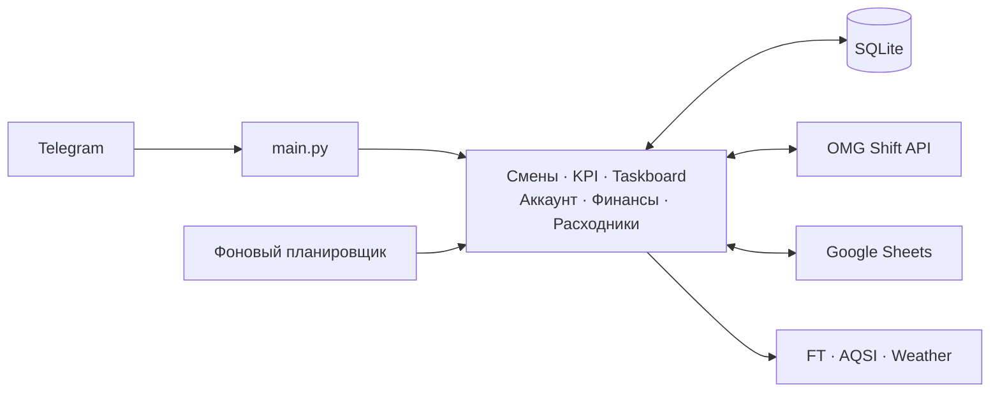
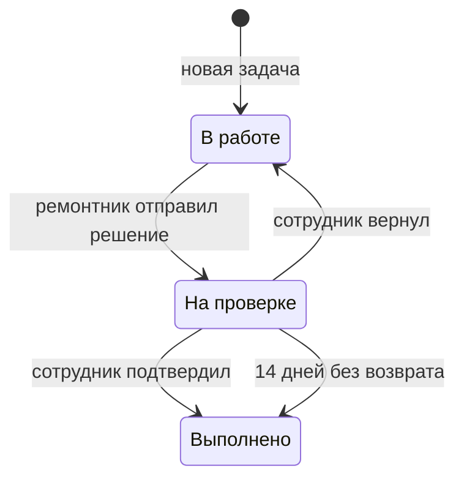

# Виарыч · OMG Bot

Внутренний Telegram-бот сети OMG VR. Он связывает Telegram, OMG Shift, Google Sheets, SQLite и рабочие отчёты в одну систему: сотрудники открывают и закрывают смены, вносят KPI и задачи, а менеджеры получают отчёты и управляют операционными функциями.

> Проект не является универсальным публичным ботом. Для запуска нужны внутренние чаты, таблицы, сервисный Google-аккаунт и доступ к OMG Shift.

## Возможности

- регистрация сотрудников с проверкой участия в рабочей Telegram-группе;
- открытие и закрытие смен с геолокацией, фотоотчётами и контролем клуба по расписанию;
- расписание на день и неделю из OMG Shift;
- личные уведомления об изменениях расписания;
- учёт KPI через хештеги с синхронизацией SQLite, OMG Shift и Google Sheets;
- личный кабинет, синхронизация ФИО и Telegram-логина, статистика за месяц и всё время;
- анонимная доска задач с обработкой, проверкой решения, возвратом в работу и автозакрытием;
- учёт расходников по клубам и недельные отчёты;
- финансовые сверки, инкассация, отчёты по выручке и ЗП;
- служебные рассылки и диагностика Telegram, SQLite, OMG Shift, Google Sheets и планировщика;
- ролевая модель доступа с журналом изменений.

## Как устроен проект



`main.py` создаёт таблицы, применяет одноразовые миграции, регистрирует Telegram-обработчики и запускает отдельный поток планировщика. SQLite хранит рабочее состояние и историю; Google Sheets используются как витрина, KPI-расчёт и часть управляемой конфигурации.

### Основные модули

| Файл | Ответственность |
| --- | --- |
| `main.py` | точка входа, Telegram-роутинг, схема SQLite, планировщик |
| `auth.py`, `permissions.py` | регистрация, роли, проверка доступа, аудит |
| `menu.py`, `account.py` | меню, помощь, профиль и личная статистика |
| `rasp.py` | расписание, Telegram chat ID в OMG Shift, очередь уведомлений |
| `openclose.py` | открытие, закрытие, GPS-проверка и отчёты смен |
| `kpi.py`, `sql_scripts.py`, `sheets.py` | KPI-хештеги, история смен, SQL-агрегации и Google Sheets |
| `taskboard.py` | анонимная доска задач и её жизненный цикл |
| `consumables.py` | учёт и отчёты по расходникам |
| `finance.py` | финансовые сверки, ЗП, инкассация и отчёты |
| `admin_panel.py` | рассылки, конфигурация, здоровье систем, роли и админ-функции |
| `scripts/backfill_legacy_shifton.py` | одноразовое восстановление смен из старого Shifton |

## Роли и доступ

Авторизация всегда выполняется по числовому Telegram ID (`users_new.chatid`), а не по изменяемому `@username`.

| Статус | Роль | Доступ |
| ---: | --- | --- |
| `-1` | заблокирован | доступ к боту закрыт |
| `0` | сотрудник | смены, Taskboard, расписание, аккаунт, KPI, расходники |
| `1` | ремонтник | всё из роли `0` и обработка активных задач |
| `2` | менеджер | всё из роли `1` и админ-панель без финансов |
| `3` | руководство | полный доступ: финансы, роли, аудит и все нижестоящие функции |

Новая регистрация всегда выдаёт роль `0`. Пароля админа и самостоятельного выбора роли нет. Роли меняет только роль `3` через админ-панель; каждое изменение пишется в `role_audit`. Последнего владельца нельзя понизить.

При первом запуске на старой БД одноразовая миграция переводит старые роли `1 → 2` и `2 → 3`. Маркер `roles_v2_0_1_2_3` в `schema_migrations` не даёт повторить повышение при перезапусках.

## Taskboard

Доска проблем принципиально анонимна: автор заявки не хранится и не показывается ни в одной роли.



После ответа задача исчезает из `Текущих`, `Ремонта` и других активных фильтров, а попадает в `👀 Рассматриваемые`. В `09:20` по Москве бот берёт сегодняшнее расписание OMG Shift и напоминает в личку сотрудникам смены только о задачах их клуба. Повторные смены одного сотрудника не создают дубли уведомлений.

## KPI и реакции

Поддерживаемые хештеги:

| Хештег | Пример | Куда попадает |
| --- | --- | --- |
| `#продление` | `#продление Татьяна 15:00–16:00` | SQLite, KPI helper |
| `#др` | `#др Елена 15:00` | SQLite, KPI helper, OMG Shift |
| `#инициатива` | `#инициатива починил крепление` | SQLite, KPI helper |
| `#серт` | `#серт 3001 50000` | SQLite, KPI helper |
| `#абик` | `#абик 101 50000` | SQLite, KPI helper |
| `#отзывы` | `#отзывы 3 2ГИС` | SQLite, KPI helper |
| `#двойная` | `#двойная 1,5 пиковая нагрузка` | SQLite, OMG Shift |
| `#автосим` | `#автосим 750,50` | SQLite, OMG Shift |
| `#активация` | `#активация 500` | SQLite, OMG Shift |
| `#штраф` | `#штраф @login причина` | SQLite; только роль `3` |

Клуб для `#продление`, `#др` и `#инициатива` определяется по смене в OMG Shift. Для дробных чисел в `#двойная`, `#автосим` и `#активация` можно использовать точку или запятую.

Политика ответа не засоряет чат:

- успех — случайная реакция из `emojis.confirm`;
- неверный формат — 👎;
- техническая ошибка или локально сохранённая запись с ошибкой OMG Shift — текстовое сообщение.

## Профиль и синхронизация личности

OMG Shift является источником истины для реальных имени и фамилии. Раздел `Аккаунт → Синхронизация с OMG Shift`:

1. проверяет публичный Telegram username;
2. находит карточку сотрудника в OMG Shift;
3. принимает оттуда ФИО и обновляет Telegram-логин;
4. атомарно меняет все найденные ссылки на старый `@username` в SQLite;
5. обновляет зависимые Google-таблицы.

Самостоятельно можно менять ник, дату рождения, телефон и email. Статистика в аккаунте объединяет глобальный KPI из `KPI OMG VR` и доступную историю из SQLite. Если Google Sheets временно недоступен, бот возвращает локальную статистику.

## Расписание фоновых задач

Все фиксированные моменты времени ниже указаны по `Europe/Moscow`.

| Время | Задача |
| --- | --- |
| каждые 15 секунд | проверка очереди уведомлений OMG Shift |
| каждую минуту | динамические рассылки и проверки открытия/закрытия |
| `04:30` | синхронизация Telegram chat ID и профилей с OMG Shift |
| время `AutoCloseTime` каждого клуба | ночной сброс состояния физического клуба |
| `09:00` | утреннее расписание; по понедельникам — финансовый отчёт в `CHAT_REPORTS` |
| `09:05`, понедельник | список активных задач в `CHAT_REPORTS` |
| `09:10` | автозакрытие Taskboard; по понедельникам — отчёт по расходникам |
| `09:20` | личные напоминания смене о задачах `На проверке` |
| `10:00` | обновление KPI и скользящего окна смен |

Конкретные будильники открытия и закрытия клубов читаются из `data/clubs.json`.

## Требования

- Docker Engine с Docker Compose v2 — рекомендуемый способ;
- либо Python `3.12` и системная локаль `ru_RU.UTF-8`;
- Telegram-бот, добавленный в рабочую группу с правом проверять участников;
- доступ к OMG Shift Bot API;
- Google service account с доступом к рабочим таблицам;
- закрытые runtime-файлы `data/clubs.json` и `data/phrases.json`.

## Конфигурация

Создайте `.env` из [`.env.example`](.env.example). `.env` игнорируется Git и не изменяется при `git pull`.

| Переменная | Назначение | Обязательна |
| --- | --- | :---: |
| `TELEGRAM_API_KEY` | токен бота от BotFather | ✅ |
| `SHIFTON_API_URL` | базовый URL OMG Shift без `/` в конце | ✅ |
| `SHIFTON_API_TOKEN` | Bearer-токен OMG Shift | ✅ |
| `CHAT_REPORTS` | канал отчётов | ✅ |
| `CHAT_MAIN_GROUP` | основная рабочая группа | ✅ |
| `CHAT_REPAIR_EXTRA` | дополнительный чат по ремонтам | ✅ |
| `CHAT_ME` | служебный Telegram chat ID | ✅ |
| `FT_API_KEY` | доступ к FT для финансовых сверок | для финансов |
| `AQSI_API_KEY` | доступ к AQSI для чеков и отчётов | для финансов |
| `WEATHER_KEY` | API-ключ погоды | для `/weather` |
| `MESSAGE_LIMIT_TIME` | антифлуд в секундах, по умолчанию `20` | — |
| `SHIFTON_USER`, `SHIFTON_PASS`, `SHIFTON_CLIENT_ID`, `SHIFTON_CLIENT_SECRET` | устаревший Shifton API для одноразового backfill | только для backfill |

При отсутствии обязательных параметров `validate_config()` завершит запуск и перечислит отсутствующие имена.

### Закрытые runtime-файлы

Эти данные не хранятся в Git, их нужно перенести из защищённой копии проекта:

```text
.env
db/omgbot.sql
data/clubs.json
data/phrases.json
key/omgbot-430116-e9a4d9c69b7f.json
```

Сервисному Google-аккаунту из файла ключа нужно выдать доступ к таблицам `KPI OMG VR`, `KPI helper`, `Сотрудники`, `Расписание`, `Открытия и закрытия`, `Виарыч`, `Расходники` и таблице-источнику анкет.

### Настройки клубов через Google Sheets

Рабочий источник настроек находится в таблице [Виарыч](https://docs.google.com/spreadsheets/d/1LxBCPpWXtpS_EVhGUNuH2k4HtPnsu53ZF-4QaRET08Q/edit). Кнопка `Обновить настройки` в административном меню при первом запуске создаёт и заполняет четыре листа:

- `Clubs` для клубов, тегов, геолокации, расписания, отображения в OMG Shift и количества вариантов вопросов;
- `Config Questions` для вопросов открытия и закрытия;
- `Config Checklists` для чек-листов;
- `Config Validation` для результата последней публикации.

Старые листы `Settings`, `Tags` и `Questions` при переходе не удаляются. После создания новых листов редактировать нужно только новую схему. Изменения применяются кнопкой `Обновить настройки`: бот сначала полностью проверяет таблицу, затем атомарно сохраняет `data/clubs.json`, создаёт `data/clubs.json.bak` и сразу переключает работающий процесс на новую версию. При ошибке локальный файл и активная конфигурация не меняются.

Обычные команды не обращаются к Google. Они читают конфигурацию из памяти, поэтому редактирование через таблицу не замедляет работу бота.

`ClubID` и `Name` уже опубликованного клуба являются стабильной связкой: синхронизация не даст переименовать её, потому что название используется в истории SQLite и других таблицах. Остальные поля редактируются через Google. Новый клуб можно добавить новой строкой с новым уникальным `ClubID`.

`AccountName` хранит форму названия для текстов бота, а `ShiftName` должно точно совпадать с названием локации в OMG Shift. `ScheduleVisible` и `ScheduleEmoji` управляют присутствием и значком клуба в расписании.

## Первый запуск через Docker

```bash
git clone <repository-url> omgbot
cd omgbot

cp .env.example .env
mkdir -p db data/photo key Reports
# Заполнить .env и перенести закрытые runtime-файлы.

docker compose up -d --build
docker compose ps
docker compose logs -f bot
```

Compose:

- собирает образ на Python `3.12-slim` с `ru_RU.UTF-8`;
- загружает `.env` через `env_file`;
- монтирует `db`, `data`, `key` и `Reports` как постоянные каталоги;
- перезапускает бота после ошибки или перезагрузки сервера.

При первом `/start` пользователь должен состоять в `CHAT_MAIN_GROUP` и иметь публичный Telegram username. Бот должен видеть состав группы.

### Первый владелец на чистой БД

На чистой БД сначала зарегистрируйте нужный аккаунт через `/start`, затем остановите бота, проверьте запись и назначьте роль `3`:

```bash
docker compose stop bot
sqlite3 db/omgbot.sql "SELECT ID, login, status, chatid FROM users_new;"
sqlite3 db/omgbot.sql "UPDATE users_new SET status=3 WHERE lower(login)=lower('@telegram_username');"
docker compose start bot
```

Дальше все роли назначаются из админ-панели. На существующей БД старая роль `2` автоматически станет ролью `3` при одноразовой миграции.

## Локальный запуск без Docker

```bash
python -m venv .venv
source .venv/bin/activate
pip install -r requirements.txt
python main.py
```

В PowerShell активация окружения выглядит так:

```powershell
python -m venv .venv
.\.venv\Scripts\Activate.ps1
pip install -r requirements.txt
python main.py
```

Без Docker система должна сама предоставить локаль `ru_RU.UTF-8`. На Windows проще и ближе к production использовать Docker.

## Обновление production

Перед обновлением остановите бота и сделайте копию SQLite. Не копируйте активно изменяемый `.sql`-файл.

```bash
cd ~/omgbot
docker compose stop bot

mkdir -p backups
cp db/omgbot.sql "backups/omgbot-$(date +%Y%m%d-%H%M%S).sql"

git pull --ff-only
docker compose up -d --build
docker compose ps
docker compose logs --tail=200 bot
```

`.env`, база, Google-ключ и `data/*.json` не обновляются через Git. После `git pull` они остаются на сервере. Первый старт новой версии сам добавит отсутствующие таблицы и выполнит ещё не применённые миграции.

### Чек-лист после деплоя

1. `docker compose ps` показывает `Up`.
2. В логах нет циклического падения.
3. `/start` в личке открывает меню.
4. `Админ-панель → 🩺 Статус систем` показывает Telegram, SQLite, OMG Shift, Google Sheets и планировщик зелёными.
5. У ролей `0/1/2/3` отображаются ожидаемые кнопки.
6. При необходимости KPI проверяется заранее согласованной тестовой записью с её последующим удалением из SQLite/Google Sheets.

## История смен

Ежедневная KPI-синхронизация загружает из OMG Shift скользящее окно: 7 дней назад и 7 дней вперёд. Она заменяет только строки с `source='omg_shift'` в этом окне и не удаляет более старую историю или строки других источников.

Одноразовый backfill из старого Shifton по умолчанию работает в dry-run:

```bash
python scripts/backfill_legacy_shifton.py --start 2026-07-13 --end 2026-07-19
```

После проверки вывода:

```bash
python scripts/backfill_legacy_shifton.py \
  --start 2026-07-13 \
  --end 2026-07-19 \
  --apply \
  --sync-sheets
```

Строки сохраняются с `source='legacy_shifton'`, поэтому обычная синхронизация OMG Shift их не сотрёт. Повторный `--apply` идемпотентен для выбранного периода.

## Тесты

Тесты написаны на стандартном `unittest`, используют временные SQLite-базы и моки внешних API.

```bash
python -m compileall -q .
python -m unittest discover -s tests -v
git diff --check
```

Покрыты:

- KPI-роутинг, дробные суммы и политика Telegram-реакций;
- сохранение истории смен и legacy backfill;
- синхронизация профиля и зависимостей;
- роли, одноразовая миграция, аудит и защита последнего владельца;
- очередь уведомлений OMG Shift;
- Taskboard: автозакрытие и адресные напоминания;
- безопасная SQL-запись и системная диагностика.

## Диагностика

```bash
docker compose ps
docker compose logs --tail=200 bot
docker compose logs -f bot
```

Меню `Админ-панель → 🩺 Статус систем` проверяет:

- Telegram Bot API;
- доступ к SQLite и число сотрудников;
- обязательную конфигурацию;
- OMG Shift API;
- Google Sheets;
- поток планировщика;
- время последней проверки очереди OMG Shift и последней синхронизации чатов.

Частые причины ошибок:

| Симптом | Что проверить |
| --- | --- |
| бот завершается сразу | ошибку `validate_config`, `.env` и `docker compose logs bot` |
| `/start` не пускает | участие в `CHAT_MAIN_GROUP`, публичный username и права бота в группе |
| OMG Shift не находит сотрудника | совпадение Telegram-тега в Telegram и карточке OMG Shift |
| не обновляются Google Sheets | файл ключа, доступ service account к таблицам и квоты Google API |
| нет личных уведомлений | `users_new.chatid`, Telegram-тег в OMG Shift и статус очереди в админ-панели |
| `database is locked` | что запущен только один экземпляр бота |

## Безопасность и данные

- Не добавляйте в Git `.env`, `db`, `key`, `Reports`, `dump` и рабочие `data`.
- Не вставляйте токены и chat ID в логи, README, issue и commit message.
- После утечки секрета недостаточно удалить его из файла: перевыпустите токен/ключ у поставщика.
- Перед деплоем, миграцией и массовыми изменениями делайте резервную копию `db/omgbot.sql`.
- Taskboard анонимен по бизнес-требованию: не добавляйте туда скрытое хранение автора.

## Рабочие данные и Git

| Каталог/файл | Хранится в Git | Назначение |
| --- | :---: | --- |
| исходные `*.py`, `tests`, Docker-файлы | ✅ | код и автотесты |
| `.env.example` | ✅ | шаблон конфигурации без секретов |
| `.env` | ❌ | токены, API-ключи и chat ID |
| `db/` | ❌ | SQLite и вся рабочая история |
| `key/` | ❌ | Google service account |
| `data/` | ❌ | клубы, фразы и временные фото |
| `Reports/` | ❌ | сгенерированные отчёты |
| `dump/` | ❌ | старый код и локальные артефакты |

Поэтому обычное обновление сервера — это `git pull --ff-only` и пересборка/перезапуск контейнера. Секреты и рабочие данные при этом остаются на месте.

---

Владелец и production-оператор должны иметь актуальную копию `.env`, `db`, `data` и `key` в защищённом хранилище. Git не заменяет backup.
