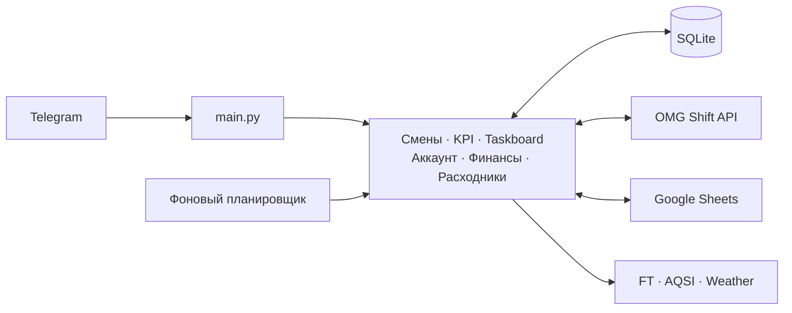
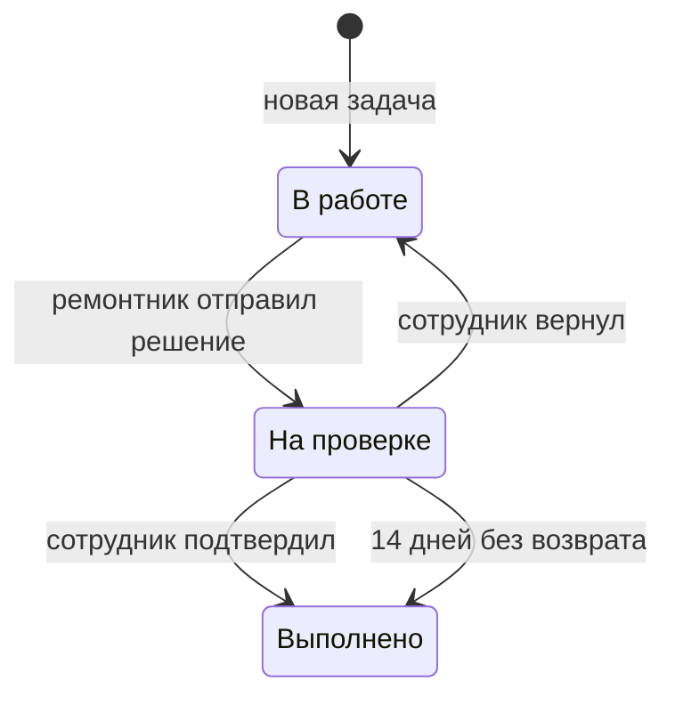

# Виарыч · OMG Bot

Внутренний Telegram-бот сети OMG VR. Он связывает Telegram, OMG Shift, Google Sheets, SQLite и рабочие отчёты в одну систему: сотрудники открывают и закрывают смены, вносят KPI и задачи, а менеджеры получают отчёты и управляют операционными функциями.

> Проект не является универсальным публичным ботом. Для запуска нужны внутренние чаты, таблицы, сервисный Google-аккаунт и доступ к OMG Shift.

## Возможности

- регистрация сотрудников с проверкой участия в рабочей Telegram-группе;
- открытие и закрытие смен с геолокацией, фотоотчётами и контролем клуба по расписанию;
- расписание на день и неделю из OMG Shift;
- личные уведомления об изменениях расписания;
- учёт KPI через хештеги с синхронизацией SQLite, OMG Shift и Google Sheets;
- личный кабинет, синхронизация ФИО и Telegram-логина, статистика за месяц и всё время;
- анонимная доска задач с обработкой, проверкой решения, возвратом в работу и автозакрытием;
- учёт расходников по клубам и недельные отчёты;
- финансовые сверки, инкассация, отчёты по выручке и ЗП;
- служебные рассылки и диагностика Telegram, SQLite, OMG Shift, Google Sheets и планировщика;
- ролевая модель доступа с журналом изменений.

## Как устроен проект


```mermaid
flowchart LR
    TG[Telegram] --> MAIN[main.py]
    MAIN --> MODULES[Смены · KPI · Taskboard<br/>Аккаунт · Финансы · Расходники]
    MODULES <--> DB[(SQLite)]
    MODULES <--> SHIFT[OMG Shift API]
    MODULES <--> GS[Google Sheets]
    MODULES --> EXT[FT · AQSI · Weather]
    SCHED[Фоновый планировщик] --> MODULES
```

`main.py` применяет версионированные изменения схемы, проверяет рабочие таблицы, регистрирует Telegram-обработчики и запускает отдельный поток планировщика. SQLite хранит рабочее состояние и историю; Google Sheets используются как витрина, KPI-расчёт и часть управляемой конфигурации.

### Основные модули

| Файл | Ответственность |
| --- | --- |
| `main.py` | точка входа, Telegram-роутинг, схема SQLite, планировщик |
| `auth.py`, `permissions.py` | регистрация, роли, проверка доступа, аудит |
| `menu.py`, `account.py` | меню, помощь, профиль и личная статистика |
| `rasp.py` | расписание, Telegram chat ID в OMG Shift, очередь уведомлений |
| `openclose.py` | открытие, закрытие, GPS-проверка и отчёты смен |
| `kpi.py`, `sql_scripts.py`, `sheets.py` | KPI-хештеги, история смен, SQL-агрегации и Google Sheets |
| `taskboard.py` | анонимная доска задач и её жизненный цикл |
| `consumables.py` | учёт и отчёты по расходникам |
| `finance.py` | финансовые сверки, ЗП, инкассация и отчёты |
| `bukza.py` | локальная база заказов Bukza, история изменений и уведомления |
| `admin_panel.py` | рассылки, конфигурация, здоровье систем, роли и админ-функции |

## Роли и доступ

Авторизация всегда выполняется по числовому Telegram ID (`users.chatid`), а не по изменяемому `@username`.

| Статус | Роль | Доступ |
| ---: | --- | --- |
| `-1` | заблокирован | доступ к боту закрыт |
| `0` | сотрудник | смены, Taskboard, расписание, аккаунт, KPI, расходники |
| `1` | ремонтник | всё из роли `0` и обработка активных задач |
| `2` | менеджер | всё из роли `1` и админ-панель без финансов |
| `3` | руководство | полный доступ: финансы, роли, аудит и все нижестоящие функции |

Новая регистрация всегда выдаёт роль `0`. Пароля админа и самостоятельного выбора роли нет. Роли меняет только роль `3` через админ-панель; каждое изменение пишется в `role_audit`. Последнего владельца нельзя понизить.

## Taskboard

Доска проблем принципиально анонимна: автор заявки не хранится и не показывается ни в одной роли.


```mermaid
stateDiagram-v2
    state "В работе" as work
    state "На проверке" as review
    state "Выполнено" as done
    [*] --> work: новая задача
    work --> review: ремонтник отправил решение
    review --> work: сотрудник вернул
    review --> done: сотрудник подтвердил
    review --> done: 14 дней без возврата
```

После ответа задача исчезает из `Текущих`, `Ремонта` и других активных фильтров, а попадает в `👀 Рассматриваемые`. В `09:20` по Москве бот берёт сегодняшнее расписание OMG Shift и напоминает в личку сотрудникам смены только о задачах их клуба. Повторные смены одного сотрудника не создают дубли уведомлений.

Ремонты, созданные в Mini App, дополнительно связаны с нормализованными
справочниками оборудования и мест через `tasks.ID`. Основной жизненный цикл,
фото и переписка по-прежнему находятся в `tasks`, поэтому бот и приложение
работают с одной заявкой. `repair_events` хранит точные даты новых событий, а
карточка ремонта собирает историю по клубу, оборудованию, уточнению и месту.
При первом запуске уверенные старые записи сопоставляются автоматически;
спорные доступны менеджерам и владельцам в очереди ручного сопоставления.

## KPI и реакции

Локальные KPI-хештеги:

| Хештег | Пример | Куда попадает |
| --- | --- | --- |
| `#продление` | `#продление Татьяна 15:00–16:00` | SQLite, KPI helper |
| `#инициатива` | `#инициатива починил крепление` | SQLite, KPI helper |
| `#серт` | `#серт 1234 1800` | SQLite, KPI helper |
| `#абик` | `#абик 101 50000` | SQLite, KPI helper |
| `#отзывы` | `#отзывы 3 2ГИС` | SQLite, KPI helper |
| `#штраф` | `#штраф @login причина` | SQLite; только роль `3` |

Клуб для `#продление` и `#инициатива` определяется по смене в OMG Shift.
Новые записи учитываются сразу, без согласования через Google Sheets.
Исторические отклонённые записи остаются исключёнными из KPI.
Каждый корректный локальный хештег также отправляется в OMG Shift, если сайт
настроен его обрабатывать. Исключение - `#штраф`, потому что он применяется к
указанному сотруднику, а не к автору сообщения.

Все хештеги, кроме `#штраф`, бот передаёт в общий маршрут
`POST /api/bot/hashtag`.
Список правил, тип начисления и фиксированные суммы находятся в OMG Shift и
могут меняться без обновления бота. Актуальный список и формат каждого правила
выводятся в `/help`.
Подтверждённые начисления и их история сохраняются в SQLite-таблице
`hashtag_events`. `#др` не участвует в KPI.

В одном сообщении можно передать до 10 хештегов: каждый новый хештег должен
начинаться с новой строки. Строка без хештега продолжает описание предыдущей
записи. Перед записью бот проверяет формат всех локальных KPI-хештегов, а в
`hashtag_events` хранит отдельный `hashtag_index` для каждой операции.
`#штраф` всегда отправляется отдельным сообщением.

```text
#отзывы 1 Google
#активация 500
#серт 1234 1800
```

Политика ответа не засоряет чат:

- успех — случайная реакция из `emojis.confirm`;
- неверный формат — 👎;
- техническая ошибка OMG Shift — текстовое сообщение;
- неизвестный сайту хештег молча игнорируется.

## Профиль и синхронизация личности

OMG Shift является источником истины для реальных имени и фамилии. Раздел `Аккаунт → Синхронизация с OMG Shift`:

1. проверяет публичный Telegram username;
2. находит карточку сотрудника в OMG Shift;
3. принимает оттуда ФИО и обновляет Telegram-логин;
4. атомарно меняет все найденные ссылки на старый `@username` в SQLite;
5. обновляет зависимые Google-таблицы.

При старте и ежедневно в `04:30` бот также получает полный каталог активных и
архивных сотрудников через `GET /api/bot/employees`. Первичное сопоставление
выполняется по Telegram, после чего постоянной связью служит `employee ID` OMG
Shift. Синхронизация не создаёт пользователей, не блокирует архивные карточки и
не меняет роли, `chatid`, ник, день рождения, email или локальный телефон.
Несопоставленные карточки выводятся руководству как требующие внимания.

Ставки должностей и персональные ставки сохраняются в `payroll_rates` с
историческими периодами. Старые строки `legacy_shifton` не удаляются, а начало
ставки OMG Shift определяется по первой локальной смене сотрудника из нового
сервиса. Локальная ставка с источником `manual` имеет наивысший приоритет.
Ручной запуск доступен роли `3` через
`Админ-панель → Дополнительно → Сотрудники OMG Shift`.

Самостоятельно можно менять ник, дату рождения, телефон и email. Статистика в аккаунте объединяет глобальный KPI из `KPI OMG VR` и доступную историю из SQLite. Если Google Sheets временно недоступен, бот возвращает локальную статистику.

## Расписание фоновых задач

Все фиксированные моменты времени ниже указаны по `Europe/Moscow`.

| Время | Задача |
| --- | --- |
| каждые 15 секунд | проверка очереди уведомлений OMG Shift |
| каждую минуту | динамические рассылки и проверки открытия/закрытия |
| `03:00` | согласованный backup SQLite с хранением последних 7 дней |
| `04:30` | синхронизация сотрудников, ставок, Telegram chat ID и профилей с OMG Shift |
| время `AutoCloseTime` каждого клуба | ночной сброс состояния физического клуба |
| каждые 5 минут, `08:00-23:59` | быстрое обновление броней Bukza на ближайшие 7 дней |
| `08:00` | глубокая синхронизация Bukza: последние 30 дней и будущий год |
| `08:20` | контрольное обновление Bukza перед уведомлением |
| `08:30` | уведомление `CHAT_CALLCENTER` из свежей локальной базы Bukza |
| `09:00` | утреннее расписание; по понедельникам — финансовый отчёт в `CHAT_REPORTS` |
| `09:05`, понедельник | список активных задач в `CHAT_REPORTS` |
| `09:10` | автозакрытие Taskboard; по понедельникам — отчёт по расходникам |
| `09:20` | личные напоминания смене о задачах `На проверке` |
| `10:00` | обновление KPI и скользящего окна смен |

Конкретные будильники открытия и закрытия клубов читаются из `data/clubs.json`.
Текст личных уведомлений из очереди OMG Shift экранируется и отправляется в
едином HTML-оформлении, поэтому имена и служебные символы не ломают сообщение.

## Требования

- Docker Engine с Docker Compose v2 — рекомендуемый способ;
- либо Python `3.12` и системная локаль `ru_RU.UTF-8`;
- Telegram-бот, добавленный в рабочую группу с правом проверять участников;
- доступ к OMG Shift Bot API;
- Google service account с доступом к рабочим таблицам;
- закрытые runtime-файлы `data/clubs.json` и `data/phrases.json`.

## Конфигурация

Создайте `.env` из [`.env.example`](.env.example). `.env` игнорируется Git и не изменяется при `git pull`.

| Переменная | Назначение | Обязательна |
| --- | --- | :---: |
| `TELEGRAM_API_KEY` | токен бота от BotFather | ✅ |
| `SHIFTON_API_URL` | базовый URL OMG Shift без `/` в конце | ✅ |
| `SHIFTON_API_TOKEN` | Bearer-токен OMG Shift | ✅ |
| `CHAT_REPORTS` | канал отчётов | ✅ |
| `CHAT_MAIN_GROUP` | основная рабочая группа | ✅ |
| `CHAT_REPAIR_EXTRA` | дополнительный чат по ремонтам | ✅ |
| `CHAT_ME` | служебный Telegram chat ID | ✅ |
| `CHAT_CALLCENTER` | группа Коллцентра для уведомлений Bukza | для Bukza |
| `BUKZA_EMAIL` | логин Bukza | для Bukza |
| `BUKZA_PASSWORD` | пароль Bukza | для Bukza |
| `BUKZA_SIGNIN_FILE` | защищённый JSON с `token` и `serverUrl`, по умолчанию `key/bukza-signin.private.json` | рекомендуемый способ |
| `BUKZA_ACCESS_TOKEN` | временный токен ручной сессии Bukza вместо входа по паролю | вместе с `BUKZA_SERVER_URL` |
| `BUKZA_SERVER_URL` | сервер из авторизованного запроса Bukza | вместе с `BUKZA_ACCESS_TOKEN` |
| `BUKZA_TABLE_ID` | ID таблицы бронирований, по умолчанию `154891` | — |
| `BUKZA_PUBLIC_SERVER` | публичный сервер авторизации Bukza | — |
| `BUKZA_HISTORY_START` | начало первичного импорта, по умолчанию `2019-01-01` | — |
| `FT_API_KEY` | доступ к FT для финансовых сверок | для финансов |
| `AQSI_API_KEY` | доступ к AQSI для чеков и отчётов | для финансов |
| `WEATHER_KEY` | API-ключ погоды | для `/weather` |
| `MESSAGE_LIMIT_TIME` | антифлуд в секундах, по умолчанию `20` | — |

При отсутствии обязательных параметров `validate_config()` завершит запуск и перечислит отсутствующие имена.
Если настройки Bukza не заполнены, только ежедневная проверка бронирований
пропускается, остальные функции бота продолжают работать.

### Неоплаченные брони Bukza

Каждый день в `08:30` по Москве бот проверяет период от текущей даты до
воскресенья через две недели. В уведомление попадают только суббота и
воскресенье, нулевая оплата и брони с 5 или более участниками либо ресурсом
`мероприятие`. Технические, отменённые и отмеченные как `не пришёл` заказы
исключаются. Если список пуст, сообщение не отправляется. Неоплаченная бронь
повторяется в ежедневном напоминании, пока не изменится её состояние.

Синхронизация и уведомление выполняются раздельно. При старте бот в фоне
обновляет ближайшие 7 дней, в `08:00` обновляет последние 30 дней и будущий
год, а в течение рабочего дня повторяет быструю синхронизацию каждые 5 минут.
Если первичный импорт ещё не завершён, первый запуск вместо быстрого обновления
диапазонами загружает всю историю с `BUKZA_HISTORY_START`.
Уведомление в `08:30` только читает SQLite и не отправляется, если последнее
успешное обновление старше 15 минут. Ограничение Bukza в 5000 строк обходится
автоматическим дроблением периода. Текущее состояние хранится в
`bukza_orders`, изменения оплаты, статуса, даты, ресурса и количества гостей -
в `bukza_order_history`, состояние синхронизации - в `bukza_sync_state`.
Имена, телефоны и другие данные клиентов в SQLite не сохраняются.

На главной странице Mini App брони читаются только из SQLite и обновляются раз
в минуту. Сотрудники видят время, формат и число гостей только для клуба своей
сегодняшней смены. Сотрудники Коллцентра видят ближайшие неоплаченные брони за
21 день с номером-ссылкой на Bukza. Роли `2-3` видят краткую сводку сегодняшних
броней по всем физическим клубам. Фиксированные коды ресурсов: `ЛЕН`, `МАР`,
`КАШ`, `ПРО`, `ДМИ`.

Файл `key/bukza-signin.private.json` читается при каждой синхронизации, поэтому
его можно безопасно заменить после истечения сессии. Поле `serverUrl` может быть
как адресом сервера, так и полным URL запроса из браузера — приложение само
выделит базовый адрес. Файл исключён из Git и подключается в контейнер через
том `./key:/app/key`.

Первичный импорт можно запустить вручную после настройки доступа:

```bash
docker compose exec bot python bukza.py
```

После добавления новых полей к уже заполненной базе один раз выполните полный
backfill:

```bash
docker compose exec bot python bukza.py --full
```

### Закрытые runtime-файлы

Эти данные не хранятся в Git, их нужно перенести из защищённой копии проекта:

```text
.env
db/omgbot.sql
data/clubs.json
data/phrases.json
key/omgbot-430116-e9a4d9c69b7f.json
```

Сервисному Google-аккаунту из файла ключа нужно выдать доступ к таблицам `KPI OMG VR`, `KPI helper`, `Сотрудники`, `Открытия и закрытия`, `Виарыч`, `Расходники` и таблице-источнику анкет.

### Настройки клубов через Google Sheets

Рабочий источник настроек находится в таблице [Виарыч](https://docs.google.com/spreadsheets/d/1LxBCPpWXtpS_EVhGUNuH2k4HtPnsu53ZF-4QaRET08Q/edit). Для синхронизации используются три листа:

- `🏷 Клубы` для Telegram-тегов и отображения в расписании;
- `🕒 Время работы` для времени открытия, закрытия и проверок;
- `_Система` с защищёнными техническими полями, которые менеджеры не редактируют.

Лист `📘 Инструкция` является обычной памяткой и ботом не импортируется. Вопросы и чек-листы управляются через раздел `OMG SHIFT` в Mini App. Листы `❓ Вопросы смены` и `🚦 Проверка` для работы синхронизации не нужны.

В листе вопросов выбираются клуб, действие, набор `A/B/C`, номер и формат ответа. `Все наборы` добавляет строку в каждый набор. Пункт чек-листа можно привязать к вопросу или оставить вопрос пустым, если нужно только напоминание. При каждом новом открытии или закрытии бот случайно выбирает набор, показывает его чек-лист и после подтверждения задаёт вопросы того же набора.

Конфигурационные листы автоматически не создаются: при отсутствии любого из них синхронизация завершится ошибкой. Изменения применяются кнопкой `Обновить настройки`: бот сначала полностью проверяет таблицу, затем атомарно сохраняет `data/clubs.json`, создаёт `data/clubs.json.bak` и сразу переключает работающий процесс на новую версию. При ошибке локальный файл и активная конфигурация не меняются.

Обычные команды не обращаются к Google. Они читают конфигурацию из памяти, поэтому редактирование через таблицу не замедляет работу бота.

Внутренний ID, названия, геолокация, эмодзи и количество наборов хранятся в защищённом листе. Менеджеры могут менять теги, отображение в расписании, время работы, вопросы и пункты чек-листа.

## Первый запуск через Docker

```bash
git clone <repository-url> omgbot
cd omgbot

cp .env.example .env
mkdir -p db data/photo key Reports
# Заполнить .env и перенести закрытые runtime-файлы.

docker compose up -d --build
docker compose ps
docker compose logs -f bot
```

Compose:

- собирает образ на Python `3.12-slim` с `ru_RU.UTF-8`;
- загружает `.env` через `env_file`;
- монтирует `db`, `data`, `key` и `Reports` как постоянные каталоги;
- перезапускает бота после ошибки или перезагрузки сервера.

При первом `/start` пользователь должен состоять в `CHAT_MAIN_GROUP` и иметь публичный Telegram username. Бот должен видеть состав группы.

### Первый владелец на чистой БД

На чистой БД сначала зарегистрируйте нужный аккаунт через `/start`, затем остановите бота, проверьте запись и назначьте роль `3`:

```bash
docker compose stop bot
sqlite3 db/omgbot.sql "SELECT ID, login, status, chatid FROM users;"
sqlite3 db/omgbot.sql "UPDATE users SET status=3 WHERE lower(login)=lower('@telegram_username');"
docker compose start bot
```

Дальше все роли назначаются из админ-панели.

## Локальный запуск без Docker

```bash
python -m venv .venv
source .venv/bin/activate
pip install -r requirements.txt
python main.py
```

В PowerShell активация окружения выглядит так:

```powershell
python -m venv .venv
.\.venv\Scripts\Activate.ps1
pip install -r requirements.txt
python main.py
```

Без Docker система должна сама предоставить локаль `ru_RU.UTF-8`. На Windows проще и ближе к production использовать Docker.

## Обновление production

Перед обновлением остановите бота и сделайте копию SQLite. Не копируйте активно изменяемый `.sql`-файл.

```bash
cd ~/omgbot
docker compose stop bot

mkdir -p backups
cp db/omgbot.sql "backups/omgbot-$(date +%Y%m%d-%H%M%S).sql"

git pull --ff-only
docker compose up -d --build
docker compose ps
docker compose logs --tail=200 bot
```

### Автоматические резервные копии

Каждый день в `03:00` по Москве бот создаёт согласованные копии
`db/omgbot.sql` и `db/steamtracker_v2.db` через SQLite Backup API, проверяет
их командой `PRAGMA integrity_check` и хранит в `db/backups` 7 дней.
Уведомление в `CHAT_ME` отправляется только при ошибке.

Для внепланового запуска:

```bash
docker compose exec bot python backup.py
```

Перед восстановлением остановите бот и KPI-приложение. Сначала сохраните
текущие файлы баз отдельно, затем замените нужную базу проверенной копией из
`db/backups` и запустите сервисы снова.

`.env`, база, Google-ключ и `data/*.json` не обновляются через Git. После `git pull` они остаются на сервере. При запуске бот добавляет только отсутствующие рабочие таблицы.

### Чек-лист после деплоя

1. `docker compose ps` показывает `Up`.
2. В логах нет циклического падения.
3. `/start` в личке открывает меню.
4. `Админ-панель → 🩺 Статус систем` показывает Telegram, SQLite, OMG Shift, Google Sheets и планировщик зелёными.
5. У ролей `0/1/2/3` отображаются ожидаемые кнопки.
6. При необходимости KPI проверяется заранее согласованной тестовой записью с её последующим удалением из SQLite/Google Sheets.

## История смен

Ежедневная KPI-синхронизация одним диапазонным запросом загружает из OMG Shift
скользящее окно: 7 дней назад и 7 дней вперёд. Недельное расписание также
получает всю неделю одним запросом. Зарплатный отчёт диапазонами дополняет
только полностью отсутствующие в БД даты; периоды длиннее ограничения API
автоматически делятся на блоки до 93 дней.

KPI-синхронизация заменяет только строки с `source='omg_shift'` в своём окне и
не удаляет более старую историю или строки других источников.

Восстановленные исторические строки старого Shifton уже сохранены с `source='legacy_shifton'`. Обычная синхронизация OMG Shift их не удаляет.

## Тесты

Тесты написаны на стандартном `unittest`, используют временные SQLite-базы и моки внешних API.

```bash
python -m compileall -q .
python -m unittest discover -s tests -v
git diff --check
```

Покрыты:

- KPI-роутинг, дробные суммы и политика Telegram-реакций;
- сохранение истории смен из нескольких источников;
- синхронизация профиля и зависимостей;
- роли, аудит и защита последнего владельца;
- валидация конфигурации клубов;
- очередь уведомлений OMG Shift;
- Taskboard: автозакрытие и адресные напоминания;
- безопасная SQL-запись и системная диагностика.

## Steam Tracker

Модуль `steamtracker/` отслеживает лицензии согласованных игр по Steam AppID,
хранит дневную динамику и готовит три отдельных промо-текста. Реальная
доставка сотрудникам, в VK и публичный Telegram выключена; подробный запуск и
dry-run согласование описаны в [`steamtracker/README.md`](steamtracker/README.md).

## Диагностика

```bash
docker compose ps
docker compose logs --tail=200 bot
docker compose logs -f bot
```

Меню `Админ-панель → 🩺 Статус систем` проверяет:

- Telegram Bot API;
- доступ к SQLite и число сотрудников;
- обязательную конфигурацию;
- OMG Shift API;
- Google Sheets;
- поток планировщика;
- время последней проверки очереди OMG Shift и последней синхронизации чатов.

Частые причины ошибок:

| Симптом | Что проверить |
| --- | --- |
| бот завершается сразу | ошибку `validate_config`, `.env` и `docker compose logs bot` |
| `/start` не пускает | участие в `CHAT_MAIN_GROUP`, публичный username и права бота в группе |
| OMG Shift не находит сотрудника | совпадение Telegram-тега в Telegram и карточке OMG Shift |
| не обновляются Google Sheets | файл ключа, доступ service account к таблицам и квоты Google API |
| нет личных уведомлений | `users.chatid`, Telegram-тег в OMG Shift и статус очереди в админ-панели |
| `database is locked` | что запущен только один экземпляр бота |

## Безопасность и данные

- Не добавляйте в Git `.env`, `db`, `key`, `Reports`, `dump` и рабочие `data`.
- Не вставляйте токены и chat ID в логи, README, issue и commit message.
- После утечки секрета недостаточно удалить его из файла: перевыпустите токен/ключ у поставщика.
- Перед деплоем, миграцией и массовыми изменениями делайте резервную копию `db/omgbot.sql`.
- Taskboard анонимен по бизнес-требованию: не добавляйте туда скрытое хранение автора.

## Рабочие данные и Git

| Каталог/файл | Хранится в Git | Назначение |
| --- | :---: | --- |
| исходные `*.py`, `tests`, Docker-файлы | ✅ | код и автотесты |
| `.env.example` | ✅ | шаблон конфигурации без секретов |
| `.env` | ❌ | токены, API-ключи и chat ID |
| `db/` | ❌ | SQLite и вся рабочая история |
| `key/` | ❌ | Google service account |
| `data/` | ❌ | клубы, фразы и временные фото |
| `Reports/` | ❌ | сгенерированные отчёты |
| `dump/` | ❌ | старый код и локальные артефакты |

Поэтому обычное обновление сервера — это `git pull --ff-only` и пересборка/перезапуск контейнера. Секреты и рабочие данные при этом остаются на месте.

---

Владелец и production-оператор должны иметь актуальную копию `.env`, `db`, `data` и `key` в защищённом хранилище. Git не заменяет backup.
## KPI Telegram Mini App

KPI Mini App работает в двух Docker Compose-сервисах:

- `kpi_web` обслуживает авторизованный интерфейс на внутреннем порту `8080`;
- `caddy` публикует его по постоянному адресу `https://bot.omg-vr.ru` и
  автоматически управляет HTTPS-сертификатом.

DNS-запись `A` для `bot.omg-vr.ru` должна указывать на публичный IP VDS. Порты
`80/tcp` и `443/tcp` должны быть доступны снаружи.
В серверном `.env` должен быть указан постоянный адрес:

```env
KPI_WEBAPP_URL=https://bot.omg-vr.ru
OMG_SHIFT_URL=http://31.129.109.167/?page=settings
```

Запуск или обновление бота, приложения и HTTPS-прокси:

```bash
bash scripts/deploy_kpi_https.sh
```

Скрипт собирает сервисы, ждёт доступности `/health` по HTTPS и назначает
постоянный URL кнопке Telegram. Проверить состояние можно командами:

```bash
curl -fsS https://bot.omg-vr.ru/health
docker compose logs caddy --tail=100
```

Назначить URL кнопке вручную:

```bash
docker compose exec bot python scripts/set_kpi_menu_button.py https://bot.omg-vr.ru
```

Скрипт сохраняет адрес в `data/kpi_webapp_url.txt`, поэтому команда `/kpi`
начинает использовать его без дополнительного перезапуска бота.

На страницах модулей горизонтальные свайпы используются только для навигации:
влево — следующий доступный модуль по кольцу `KPI → Taskboard → Shift`, вправо
— назад или на главную из корня модуля. `OMG Shift` доступен всем сотрудникам и
открывает внешний сайт смен; менеджерам и владельцам в нём дополнительно доступен
редактор сценариев. Открытые формы и карточки сначала закрываются свайпом вправо;
свайп влево в них не выполняет переход.

The default `Мой KPI` screen shows the current employee's place, KPI, worked
and weighted shifts, per-shift pace, distance from the team average and the
exact contribution of every metric. Employees still have unrestricted access
to the full team rating and other employee cards. Metric details show the
stored source where it can be determined reliably. The freshness block reports
the calculation time and the dates of the latest KPI record and shift.

Managers additionally receive filters by club, role, KPI zone and state. The
`Требует внимания` view includes employees in the red zone, employees with an
active penalty, a KPI drop of at least 10 percentage points over 7 days, or
worked shifts without KPI records. Club membership for filtering is derived
from every club where the employee has shifts in the selected month.

Before closing a month, the app recalculates its KPI data on the server and
shows non-blocking warnings about missing shifts, missing KPI records, red-zone
results and active penalties. Managers can close and reopen a month. Closing
stores a KPI snapshot; closing the same month again replaces the previous
snapshot without keeping an audit history.
